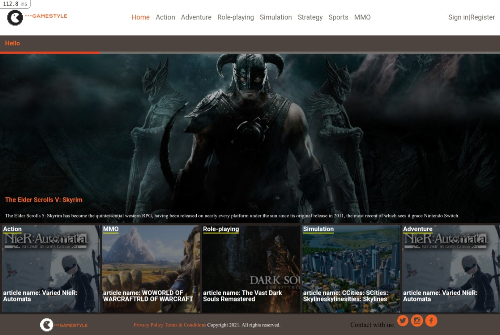
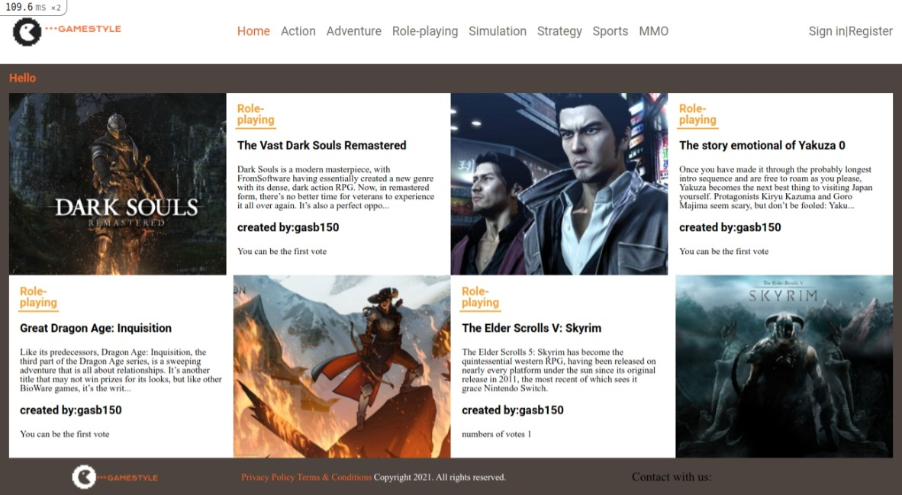
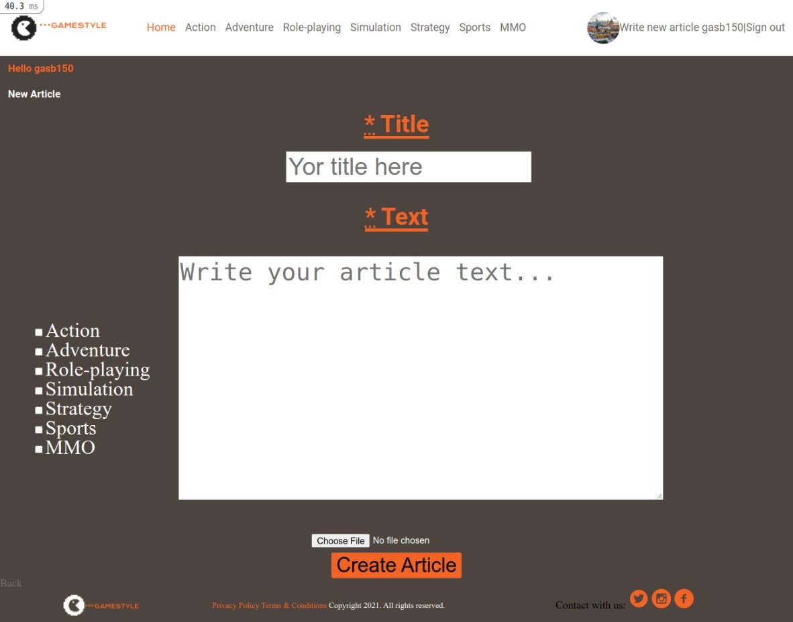
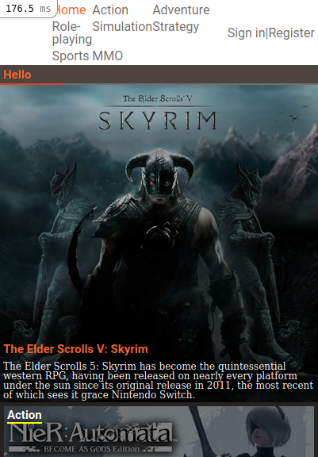
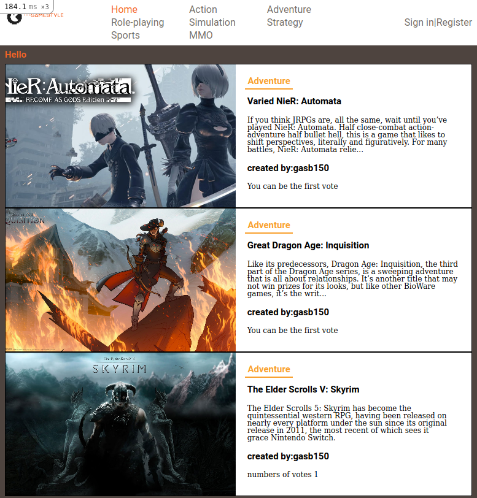

### GAME STYLE

I create a rails app, according to [Nelson Sakwa on Behance](https://www.behance.net/sakwadesignstudio) design [liFEsTlye](https://www.behance.net/gallery/14554909/liFEsTlye-Mobile-version), the user logs in to the app, the user is presented with the homepage

Each page uses the same top menu and footer, include links to pages that are implemented: Home, articles categories, write an article, and sing out. with a featured article, with the biggest number of votes, with a full-width image and title in the first row of the home page.

  
List all categories in order of priority. Displayed as a square with its name on the top and its most recent article's title at the bottom. The background image is the image of the most recent article in this category.

   


When the user clicks the category name they can see all articles in that category, will see articles are sorted by most recent, each article displays an image, title, truncated text as a preview, and its author username, with a button to add a vote for article (each user can vote only once).
    

When the user opens the Write an article page:
A form with all necessary fields is displayed.



And also this webpage it's responsive.




## :video_camera: Video description

[Video GameStyle](https://www.loom.com/share/dde557e117144f89938201ab54a0533b)

## :computer: Built With

- Ruby v2.7.2
- Ruby on Rails v6.1.3

## Live Demo

[GameStyle](https://ancient-peak-99624.herokuapp.com/)

## :wrench: Getting Started
> Take a copy of this project locally

- Go to the main page of the repo.
- Press the "Code" button and get the repo link.
- Clone it using git clone. 
```
git clone 'repo_link' 
```

### Setup
Open the terminal in the current project folder and then

1. Instal gems with:

```
1 | bundle _2.1.4_ install
```
** bundle with 2.1.4 avoid problems with Heroku **

2. Setup database with:

```
   1 | rails db:create
   2 | rails db:migrate
   3 | rails db:seed
```
### Github Actions

To make sure the linters' checks using Github Actions work properly, you should follow the next steps:

1. On your recently forked repo, enable the GitHub Actions in the Actions tab.
2. Create the `feature/branch` and push.
3. Start working on your milestone as usual.
4. Open a PR from the `feature/branch` when your work is done.

### Usage

Start server with:

```
    1 | rails server
```

Open `http://localhost:3000/` in your browser.

### Run tests

```
    1 | rpsec
```

### Deployment

To deploy it, you can use Heroku. 
1. First you will need a Heroku account and set-up for deployment.
1.1. Go to the [heroku website](https://www.heroku.com/) and create an account using the same email address you used for GitHub and Git.
1.2. Run this command 
  ```
  1 | curl https://cli-assets.heroku.com/install.sh | sh
  ```
1.3. Run this command
  ```
  1 | heroku keys:add
  ```
press y and then Enter, and now, type in the email address you used to create your Heroku account and press Enter. Then, type in the password for your Heroku account. Next, press y and Enter to allow Heroku to upload your public SSH key.
1.4. The terminal may read Invalid credentials provided. Just press any key and the Heroku website will open in your browser. Log in with the information you created your account with, and the terminal will reappear and accept your public SSH key.

2. Once you complete the first step.
2.1. Run this command
``` 
1 | heroku create
```
2.2. Then run
```
1 | git remote
```
Check that you see heroku in the output.
2.3. Push to heroku typing 
```
1 | git push heroku HEAD:master
```
2.4.
And we need to migrate the database to 
Run this command
```
1 | heroku run rails db:migrate
2 | heroku run rails db:seed
```
2.5. Enjoy this app
```
1 | heroku open
```

## Author
**Gustavo Sanmartin** :bird:
- GitHub: [@gasb150](https://github.com/gasb150)
- LinkedIn: [Gustavo Sanmartin](https://www.linkedin.com/in/gustavsanmartin/)

## 🤝 Contributing

Contributions, issues, and feature requests are welcome!

Feel free to check the [issues page](issues/).

## Show your support

Give a ⭐️ if you like this project!

## Acknowledgments

- Microverse
- [Nelson Sakwa on Behance](https://www.behance.net/sakwadesignstudio)</li>


## 📝 License

<p>This project is <a href="LICENSE">MIT</a> licensed.</p>